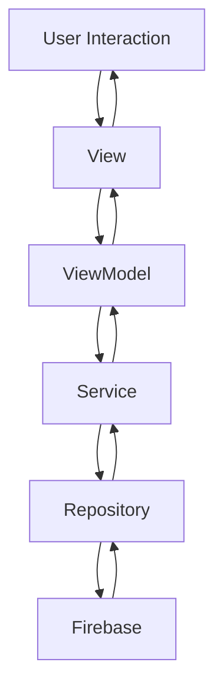

# CRM Dashboard Application

A comprehensive Customer Relationship Management (CRM) dashboard application built with Flutter. This application provides a complete solution for managing contacts, deals, tasks, and generating reports for sales teams.

## Features

- Dashboard Overview: Real-time statistics and metrics for quick business insights
- Contact Management: Store and manage customer information with ease
- Deal Pipeline: Track sales opportunities through different stages
- Task Management: Organize and prioritize daily activities
- Reporting: Generate insights on sales performance and team productivity
- Real-time Updates: Firebase integration for live data synchronization
- Responsive Design: Works seamlessly across mobile and tablet devices

## Tech Stack

- Framework: Flutter - Cross-platform UI toolkit
- State Management: Provider - Reactive state management
- Backend: Firebase - Real-time database and authentication
- Dependency Injection: GetIt - Service locator pattern
- Data Modeling: Equatable - Simplified value comparisons
- Logging: Logger - Advanced logging capabilities

## Architecture

The application follows the MVVM (Model-View-ViewModel) architectural pattern with a clean separation of concerns. This design promotes maintainability, testability, and scalability.

### High-Level Architecture

```
┌─────────────────────────────────────────────────────────────┐
│                        Presentation Layer                   │
├─────────────────────────────────────────────────────────────┤
│  Views (UI)  │  ViewModels (Business Logic)  │  Components  │
├─────────────────────────────────────────────────────────────┤
│                        Service Layer                        │
├─────────────────────────────────────────────────────────────┤
│                   Repository Layer (Abstractions)           │
├─────────────────────────────────────────────────────────────┤
│                   Data Access Layer (Implementations)       │
└─────────────────────────────────────────────────────────────┘
```

### Layer Responsibilities

1. **Presentation Layer**:
   - Views: UI components that display data and handle user interactions
   - ViewModels: Business logic and state management
   - Components: Reusable UI widgets

2. **Service Layer**:
   - Abstract services defining contracts for data operations
   - Business logic coordination

3. **Repository Layer**:
   - Repository interfaces defining data access contracts
   - Abstraction between business logic and data sources

4. **Data Access Layer**:
   - Concrete implementations of repositories
   - Direct interaction with Firebase Firestore

### Directory Structure

```
lib/
├── app/                    # Application setup and main widget
├── core/                   # Core utilities, components, and services
│   ├── components/         # Reusable UI components
│   ├── constants/          # Application constants
│   ├── di/                 # Dependency injection setup
│   ├── errors/             # Custom exception handling
│   ├── mixins/             # Reusable mixins
│   ├── repositories/       # Data repository interfaces
│   └── utils/              # Utility functions and helpers
├── models/                 # Data models (Contact, Deal, Task, etc.)
├── services/               # Service implementations
├── viewmodels/             # Business logic and state management
└── views/                  # UI screens and widgets
```

### Data Flow



### Core Components

#### 1. Models
Data structures representing business entities:
- Contact: Customer information
- Deal: Sales opportunities with pipeline stages
- Task: Activities with priorities and due dates
- Stat: Dashboard metrics
- Pipeline: Sales funnel visualization

#### 2. ViewModels
Business logic containers that manage state and handle user interactions:
- DashboardViewModel: Analytics and overview data
- ContactsViewModel: Contact management operations
- DealsViewModel: Deal pipeline management
- TasksViewModel: Task tracking and organization
- ReportsViewModel: Performance metrics and insights

#### 3. Services
Business logic implementations that coordinate between ViewModels and Repositories:
- ContactService: Contact CRUD operations
- DealService: Deal management and pipeline tracking
- TaskService: Task scheduling and completion tracking

#### 4. Repositories
Data access abstractions that define contracts for data operations:
- ContactRepository: Contact data interface
- DealRepository: Deal data interface
- TaskRepository: Task data interface

#### 5. Components
Reusable UI elements:
- Cards: Stat cards, contact cards, deal cards
- Navigation: Bottom navigation, app bar
- Forms: Input components for data entry
- Lists: Display collections of data

### State Management

The application uses the Provider package for state management, following the MVVM pattern:

1. Views subscribe to ViewModels for state changes
2. User interactions trigger ViewModel methods
3. ViewModels update state and notify listeners
4. Views rebuild with new data

This approach ensures:
- Separation of UI and business logic
- Testable business logic
- Efficient UI updates
- Predictable state management

### Dependency Injection

The application uses GetIt for dependency injection:

1. Services and repositories are registered as singletons
2. ViewModels are registered as factories
3. Dependencies are injected at application startup
4. Loose coupling between components

Benefits:
- Easier testing with mock dependencies
- Centralized dependency management
- Reduced coupling between components
- Improved code maintainability

### Data Persistence

Firebase Firestore is used for data persistence:

1. Real-time synchronization across devices
2. Offline support with local caching
3. Scalable NoSQL database
4. Automatic conflict resolution

Data structure:
- Contacts collection
- Deals collection
- Tasks collection
- Each document contains relevant fields and timestamps

### Error Handling

The application implements a comprehensive error handling strategy:

1. Custom exceptions for different error types
2. Centralized error logging
3. User-friendly error messages
4. Graceful degradation when services are unavailable

## Data Models

### Contact
- Name, email, phone, company
- Creation and update timestamps

### Deal
- Title, value, description
- Status tracking (prospect, qualified, proposal, negotiation, closed, lost)
- Automatic close date calculation
- Creation and update timestamps

### Task
- Title, description
- Due dates and completion status
- Priority levels (low, medium, high, urgent)
- Task types (follow-up, presentation, general)
- Association with contacts and deals
- Creation and update timestamps

## Installation

1. Clone the repository:
   ```bash
   git clone https://github.com/your-username/crm-app.git
   cd crm-app
   ```

2. Install dependencies:
   ```bash
   flutter pub get
   ```

3. Set up Firebase:
   - Create a new Firebase project
   - Add Android and iOS apps to your Firebase project
   - Download google-services.json for Android and GoogleService-Info.plist for iOS
   - Place these files in their respective directories

4. Configure Firebase in the app:
   - Update the package name in android/app/build.gradle
   - Update the bundle identifier in Xcode

## Running the App

```bash
flutter run
```

## Project Structure

The application is organized into five main sections accessible through the bottom navigation:

1. Dashboard: Overview of key metrics, recent activities, and pipeline progress
2. Contacts: Manage customer information and view contact statistics
3. Deals: Track sales opportunities through different pipeline stages
4. Tasks: Organize and prioritize daily activities with due dates
5. Reports: Generate insights on sales performance and team productivity

## Key Features Explained

### Dashboard
- Real-time statistics cards showing tasks, deals, and revenue
- Sales pipeline visualization
- Recent notifications and high-priority tasks
- Contact activity tracking

### Contact Management
- Add, edit, and delete contacts
- Store comprehensive contact information
- Link contacts to deals and tasks
- Search and filter capabilities

### Deal Pipeline
- Track deals through six stages: Prospect, Qualified, Proposal, Negotiation, Closed, Lost
- Automatic close date calculation based on deal status
- Deal value tracking and statistics
- Progress visualization

### Task Management
- Create tasks with due dates and priorities
- Associate tasks with specific contacts or deals
- Mark tasks as completed
- Filter by task type and priority

### Reporting
- Sales performance metrics
- Revenue tracking
- Deal closure rates
- Team productivity insights

## License

This project is licensed under the MIT License.
